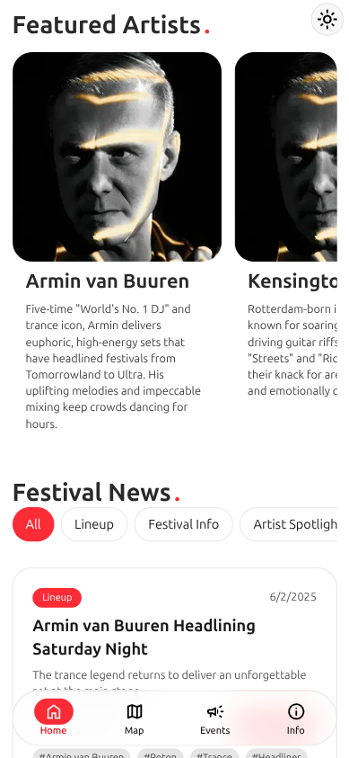
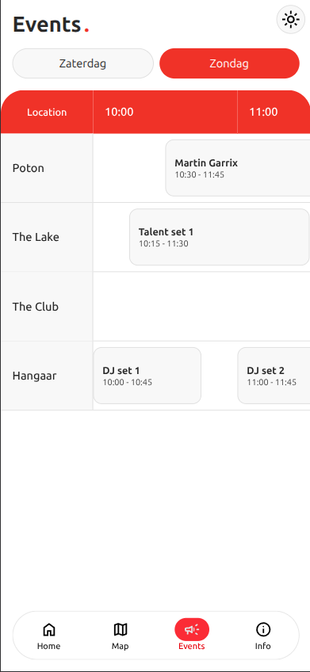
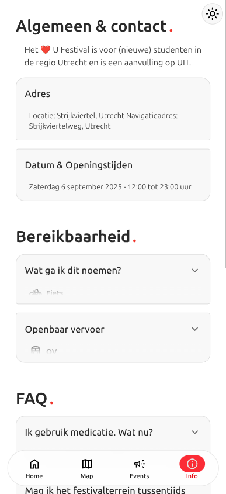

<div align="center">

<a href="#">
    
</a>

# ❤️U Festival PWA

**❤️U is a new two-day fictional festival that is organized for all (new) students in the Utrecht region.**

<div align=center>


<a href="https://u230061.gluwebsite.nl/ufest/">Website</a>

</div>

<br>

## Table of content

<div align="left">

- [Installation](#installation)
- **[Website & Download](#download--website)**
- [Screenshots](#screenshots)
- [What I've used](#what-ive-used)
- [Project Structure](#project-structure)
- [Development Guide](#development-guide)
  - [How to add a page](#how-to-add-a-page)
  - [Where are the pages located](#where-are-the-pages-located)
  - [Where are the events/news database located](#where-are-the-eventsnews-database-located)
  - [Event Data Structure](#event-data-structure)
- [Questions](#questions)
- [Links](#links)

</div>

<br>

## Installation

<div align="left">

### Requirements

- Node.js (version 18 or higher)
- npm or yarn package manager

### Setup Instructions

1. **Clone the repository**

   ```bash
   git clone https://github.com/jvpm1/PWA-Festival-App.git
   cd PWA-Festival-App/main/client
   ```

2. **Install dependencies**

   ```bash
   npm install
   ```

3. **Start development server**

   ```bash
   npm run dev
   ```

4. **Build for production**
   ```bash
   npm run build
   ```

</div>

<br>

## Website & Download

<div align="left">

- Find the PWA on our [website](https://u230061.gluwebsite.nl/ufest/)
- Download the latest build at the [releases](https://github.com/jvpm1/PWA-Festival-App/releases) tab with [SolidJS](https://www.solidjs.com/)

</div>

<br>

## Screenshots

<div align="center">
  
  
  
</div>

<br>

## What i've used

<div align="left">

- **[SolidJS](https://www.solidjs.com/)**

- **[Vite](https://vitejs.dev/)**

- **[TypeScript](https://www.typescriptlang.org/)**

- **[Vite PWA Plugin](https://vite-pwa-org.netlify.app/)**

- **[Tailwind CSS](https://tailwindcss.com/)**

- **[Google Fonts](https://fonts.google.com/)**

- **[Google Icons](https://fonts.google.com/icons)**

- **[Leaflet](https://leafletjs.com/)**

</div>

<br>

## Project Structure

<div align="left">

```
├── assets
│   └── imgs
│       ├── banner.jpg
│       ├── logoWhite.webp
│       └── screenshots
│           ├── EventsPage.png
│           ├── HomePage.png
│           └── InfoPage.png
├── LICENSE
├── main
│   ├── client
│   │   ├── deps
│   │   │   ├── chunk-J5YFKGOT.js
│   │   │   ├── chunk-J5YFKGOT.js.map
│   │   │   ├── _metadata.json
│   │   │   ├── package.json
│   │   │   ├── solid-js.js
│   │   │   ├── solid-js.js.map
│   │   │   ├── solid-js_web.js
│   │   │   └── solid-js_web.js.map
│   │   ├── dev-dist
│   │   │   ├── suppress-warnings.js
│   │   │   ├── sw.js
│   │   │   └── workbox-54d0af47.js
│   │   ├── index.html
│   │   ├── package.json
│   │   ├── package-lock.json
│   │   ├── public
│   │   │   └── favicon.svg
│   │   ├── pwa-assets.config.ts
│   │   ├── README.md
│   │   ├── src
│   │   │   ├── App.tsx
│   │   │   ├── assets
│   │   │   ├── components
│   │   │   ├── index.css
│   │   │   ├── index.tsx
│   │   │   ├── modules
│   │   │   ├── PWABadge.module.css
│   │   │   ├── PWABadge.tsx
│   │   │   ├── routes
│   │   │   └── vite-env.d.ts
│   │   ├── tsconfig.app.json
│   │   ├── tsconfig.json
│   │   ├── tsconfig.node.json
│   │   └── vite.config.ts
│   └── server
│       └── index.ts
├── markdowns
│   └── questions.md
└── README.md
```

### Key Directories

- **`main/client/src/routes/`** - Contains all page components (Home, Events, Map, Info)
- **`main/client/src/assets/`** - Application assets including database files

</div>

<br>

## Development Guide

### How to add a page

<div align="left">

To add a new page to the application, you need to update the `routeMap` object in `main/client/src/App.tsx`. Use the following structure as an example:

```typescript
const routeMap: Record<
  Route,
  {
    name: string;
    component: Component<{}>;
    icon: string | null;
  }
> = {
  home: {
    name: "Home",
    component: Home,
    icon: HomeIcon,
  },
  map: {
    name: "Map",
    component: Map,
    icon: MapIcon,
  },
  events: {
    name: "Events",
    component: Event,
    icon: EventIcon,
  },
  info: {
    name: "Info",
    component: Info,
    icon: InfoIcon,
  },
};
```

</div>

<br>

### Where are the pages located

<div align="left">

The page components are located in `main/client/src/routes/*`

</div>

<br>

### Where are the events/news database located

<div align="left">

The events and news database files are located in `main/client/src/assets/`

</div>

<br>

### Event Data Structure

<div align="left">

Events in the database follow this TypeScript interface:

```typescript
export interface Event {
  title: string;
  location: string;
  desc: null | string;
  img?: any;
  beginDate: Date;
  endDate: Date;
}
```

Each event contains:

- `title`: The name of the event
- `location`: Where the event takes place
- `desc`: Optional description of the event (can be null)
- `img`: Optional image for the event
- `beginDate`: When the event starts
- `endDate`: When the event ends

</div>

<br>

### Questions

<div align="left">

For detailed questions and answers about the project, see [Questions](./markdowns/questions.md)

</div>

<br>

## Links

<div align="left">

### Project Management

- **[GitHub Issues](https://github.com/users/jvpm1/projects/1)**

</div>

<br>

---

### License

This project is licensed under the MIT License - see the [LICENSE](./LICENSE) file for details.

</div>
